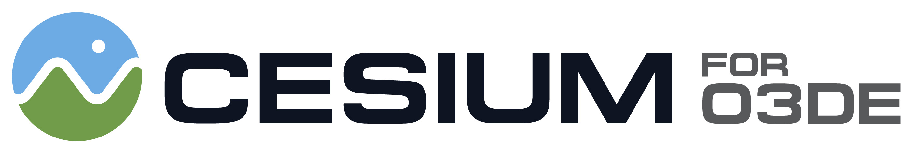
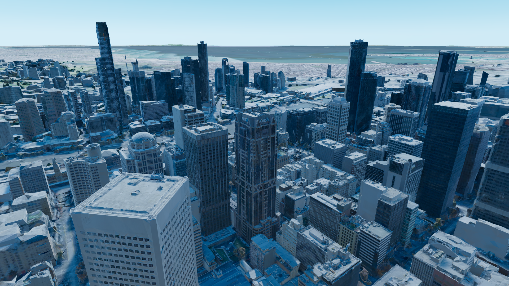
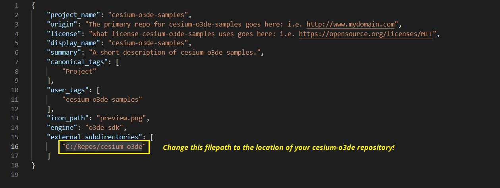
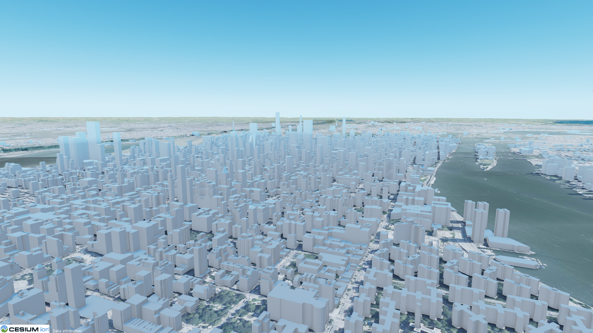

# Cesium for O3DE Samples

The Cesium for O3DE Samples is a starter project to learn and explore the [Cesium for O3DE](https://github.com/CesiumGS/cesium-o3de) gem.

The levels in this project will walk you through the plugin's features and demonstrate global-scale content, applications, and experiences in the Open 3D Engine.

*
Photogrammetry of Melbourne, Australia visualized in O3DE using Cesium for O3DE. Visit this and other locations in the <b>01_CesiumWorld</b> sample level.
*

### :rocket: Get Started

1. First, download and install the [Cesium for O3DE](https://github.com/CesiumGS/cesium-o3de) gem. Take note of your local filepath to the cesium-o3de directory, you'll need it later.
2. Clone this repository with `git clone git@github.com:CesiumGS/cesium-o3de-samples.git`. Or, [download the latest release](https://github.com/CesiumGS/cesium-o3de-samples/releases) and unzip the package.
3. In the cesium-o3de-samples folder, find and open `project.json`.  Find the `"external-subdirectories"` element and replace the existing filepath with your filepath to the `cesium-o3de` repository or package.

Save and close the `project.json` file.
4. Open the O3DE Project Manager and select **Add Existing Project**. 
5. In the window that appears, find the `cesium-o3de-samples` directory that you just downloaded.
6. Build the project, then open it.

Have questions? Ask them on the [community forum](https://community.cesium.com). You may also want to visit the [Cesium for O3DE tutorials](https://cesium.com/learn/o3de/).

## :mountain: Features

### :one: Level 01_CesiumWorld

Explore different tilesets and locations on the globe in this introductory level. Press play, then use keyboard keys 1-3 to fly to New York City, USA, Mount Fuji, Japan, and Melbourne, Australia. This level demonstrates using the Script Canvas and the Cesium plugin to fly smoothly between different locations on the globe. 

### :two: Level 02_CesiumQuickstart

This level is a simple template level consisting only of lighting, Cesium World Terrain and Cesium OSM Buildings, and the basic camera settings that you'll typically want in all your Cesium levels. Use this level as a jumping-off point to more rapidly build new experiences with Cesium and O3DE!

*
Cesium OSM Buildings and Cesium World Terrain create this New York City scene in O3DE.
*

### :information_source: Additional Features

This sample project also includes some reusable entities and components that you can use in your projects. 
- The **Cesium_Camera Prefab** is a premade camera entity with adjustable speed for viewing models up close or traveling large distances. Add it instead of the default camera to scenes where you'll need globe-aware movement. In play, use the mouse scroll wheel to adjust your speed.
- The **Adjust Sky Orientation Component** can be used on directional lights and skyboxes to ensure they remain oriented correctly when moving large distances across the globe.

## :hammer_and_wrench:Using Cesium for O3DE Samples for Development

The Cesium for O3DE Samples project can also be used for development and testing of the [Cesium for O3DE](https://github.com/CesiumGS/cesium-o3de) gem. To use this project for development, follow these steps.

1. Follow the [cesium-o3de Developer Setup guide](https://github.com/CesiumGS/cesium-o3de) to install Cesium for O3DE. 
2. Clone the Cesium for O3DE Samples repo with `git clone git@github.com:CesiumGS/cesium-o3de-samples.git`.
3. From the `cesium-o3de-samples/build/windows_vs2019` directory, open `cesium-o3de-samples.sln` with Visual Studio 2019.
4. Make edits to the `cesium-o3de` source code and save the solution.
5. Open the O3DE Project Manager and rebuild the CesiumforO3DESamples project.
6. Open the project, and see your changes in-engine!

### :green_book:License

[Apache 2.0](http://www.apache.org/licenses/LICENSE-2.0.html). Cesium for O3DE Samples is free to use as starter project for both commercial and non-commercial use.
