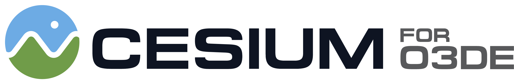

# Cesium for O3DE Samples

The Cesium for O3DE Samples is a starter project to learn and explore the [Cesium for O3DE](https://github.com/CesiumGS/cesium-o3de) gem.

The levels in this project will walk you through the plugin's features and demonstrate global-scale content, applications, and experiences in the Open 3D Engine.

[Insert a photo here!]

### :rocket: Get Started

1. To get started, download and install the [Cesium for O3DE](https://github.com/CesiumGS/cesium-o3de) gem. Take note of your local filepath to the cesium-o3de directory, you'll need it later.
2. Clone this repository with `git clone git@github.com:CesiumGS/cesium-o3de-samples.git`.
3. In the cesium-o3de-samples folder, find and open `project.json`.  Find the `"external-subdirectories"` element and replace the existing filepath with your filepath to the `cesium-o3de` repository.

Save and close the `project.json` file.
4. Open the O3DE Project Manager and select **Add Existing Project**. 
5. In the window that appears, find the `cesium-o3de-samples` directory that you just cloned.
6. Build the project, then open it.

Have questions? Ask them on the [community forum](https://community.cesium.com).

## :mountain: Features

### :one: Level 1 - Cesium World

Description of the level

### :hammer_and_wrench:Using Cesium for O3DE Samples for Development

The Cesium for O3DE Samples project can also be used for development and testing of the Cesium for O3DE gem. To use this project for development, follow these steps.

1. Follow the (cesium-o3de Developer Setup guide)[https://github.com/CesiumGS/cesium-o3de] to install Cesium for O3DE. 
2. Clone the Cesium for O3DE Samples repo with `git clone git@github.com:CesiumGS/cesium-o3de-samples.git`.
3. From the `cesium-o3de-samples/build/windows_vs2019` directory, open `cesium-o3de-samples.sln` with Visual Studio 2019.
4. Make edits to the `cesium-o3de` source code and save the solution.
5. Open the O3DE Project Manager and rebuild the cesium-o3de-samples project.
6. Open the project, and see your changes in-engine!

### :green_book:License

[Apache 2.0](http://www.apache.org/licenses/LICENSE-2.0.html). Cesium for O3DE Samples is free to use as starter project for both commercial and non-commercial use.
